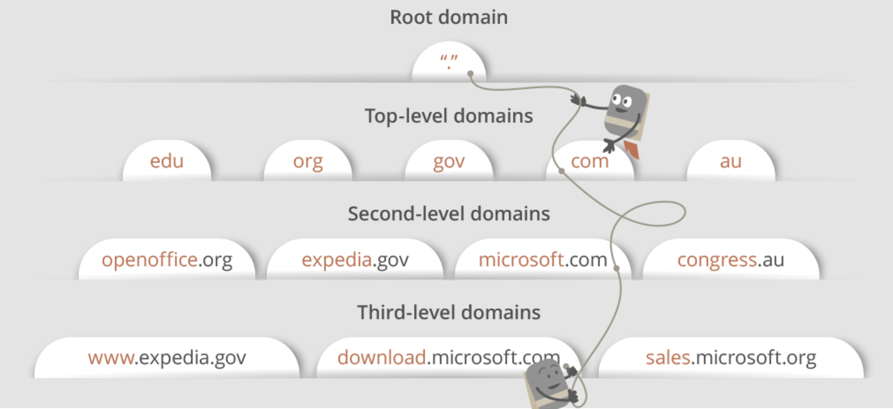

## What happens when you type google.com in browser?

Steps performed are as under:

### Enter the address
You type https://www.google.com into the address bar of your browser.

### Check cache for DNS record
The browser checks the cache for a DNS record to find the corresponding IP address of google.com.

DNS(Domain Name System) is a database that maintains the name of the website (URL) 
and the particular IP address it links to. Every single URL on the internet has a unique IP 
address assigned to it. The IP address belongs to the computer which hosts the server of the 
website we are requesting to access. For an example, www.google.com has an IP address of 
209.85.227.104. So if you’d like you can reach www.google.com by typing http://209.85.227.104 on your browser.

The main purpose of DNS is human-friendly navigation.

In order to find the DNS record, the browser checks four caches in order:

1. **Browser cache:** The browser maintains a repository of DNS records for a fixed duration for websites you have previously visited.

2. **OS Cache:** The browser would make a system call (i.e. gethostname on Windows) to your underlying computer OS to fetch the record.

3. **Router Cache:** browser would communicate with the router that maintains its’ own cache of DNS records.

4. **ISP Cache:** the browser would move on to the ISP. ISP maintains its’ own DNS server which includes a cache of DNS records.

### DNS query for IP if not found in cache
The purpose of a DNS query is to search multiple DNS servers on the internet until it finds 
the correct IP address for the website. This type of search is called a recursive search 
since the search will continue repeatedly from DNS server to DNS server until it either 
finds the IP address we need or returns an error response saying it was unable to find it.

These requests are sent using small data packets which contain information such as the 
content of the request and the IP address it is destined for (IP address of the DNS recursor).
These packets travel through multiple networking equipment between the client and the server 
before it reaches the correct DNS server. This equipment use routing tables to figure out 
which way is the fastest possible way for the packet to reach its’ destination.

### Establishing TCP connection
Once the browser receives the correct IP address it will build a connection with the server that matches IP address to transfer information.
This connection is established using a process called the **TCP/IP three-way handshake**:

1. Client machine sends a SYN packet to the server over the internet asking if it is open for new connections.

2. If the server has open ports that can accept and initiate new connections, it’ll respond with an ACKnowledgment of the SYN packet using a SYN/ACK packet.

3. The client will receive the SYN/ACK packet from the server and will acknowledge it by sending an ACK packet.

Then a TCP connection is established for data transmission!

### Making HTTP Request
The browser will send a GET request asking for google.com web page. 

### Server responds
Server handles the request using a request handler and generates a response.
The server response contains the web page you requested as well as the status code, 
compression type (Content-Encoding), how to cache the page (Cache-Control), any cookies to set, privacy information, etc.

### Browser displays the html content
First, it will render the bare bone HTML skeleton. 
Then it will check the HTML tags and sends out GET requests for additional elements on the web page, such as images, CSS stylesheets, JavaScript files etc. These static files are cached by the browser so it doesn’t have to fetch them again the next time you visit the page. 
At the end, you’ll see google.com appearing on your browser.
